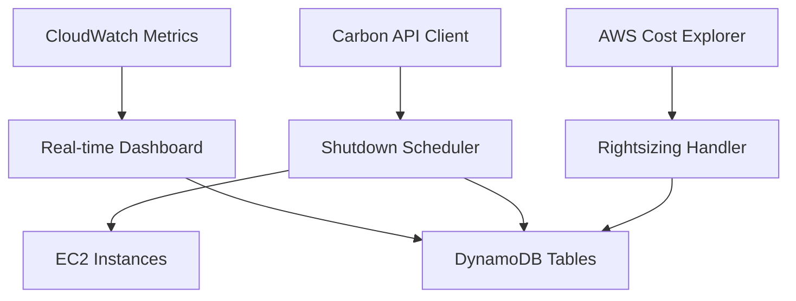

# Carbon-Aware FinOps Framework

## Overview
This project implements a Carbon-Aware FinOps framework that demonstrates how organizations can achieve sustainability goals while optimizing cloud costs through automated interventions on AWS EC2 instances.

### Key Features
- 🌱 Carbon-aware instance scheduling based on real-time carbon intensity
- 💰 Cost optimization through intelligent off-hours automation
- 📊 Unified cost and carbon reporting dashboard
- 🔄 Automated right-sizing recommendations
- 📈 Real-time carbon intensity tracking
- ⚡ AWS Lambda-based serverless architecture
- 🔧 Infrastructure as Code with Terraform

## Project Structure
```
├── infrastructure/terraform/    # Terraform infrastructure definitions
│   ├── main.tf                 # Main infrastructure resources
│   ├── variables.tf            # Terraform variables
│   └── modules/                # Reusable Terraform modules
├── src/                        # Core application code
│   ├── automation/             # Instance lifecycle management
│   ├── carbon/                 # Carbon intensity API clients
│   ├── cost/                   # AWS cost analysis
│   ├── lambda/                 # AWS Lambda handlers
│   ├── reporting/              # Dashboard and reporting
│   ├── config/                 # Centralized configuration
│   └── utils/                  # Utility modules
├── tests/                      # Unit and integration tests
├── scripts/                    # Deployment and utility scripts
└── data/                       # Data storage for results
```

## Prerequisites

### Required Software
- **Python 3.9+** - Core runtime environment
- **Terraform 1.0+** - Infrastructure as Code
- **AWS CLI 2.x** - AWS command line interface
- **Git** - Version control

### AWS Requirements
- AWS Account with appropriate permissions
- AWS SSO configured for authentication
- AWS Profile configured (`carbon-finops-sandbox` or custom)

### API Keys (Optional for Enhanced Features)
- **ElectricityMap API Key** - For detailed carbon intensity data
- **WattTime API Credentials** - Alternative carbon data source

## Complete Setup Guide

### 1. Environment Setup

#### Clone Repository
```bash
git clone https://github.com/ChristopherKlein0802/CarbonAware_FinOps_Local.git
cd CarbonAware_FinOps_Local
```

#### Create Python Virtual Environment
```bash
python3 -m venv venv
source venv/bin/activate  # On macOS/Linux
# or
venv\Scripts\activate     # On Windows
```

#### Install Dependencies
```bash
pip install -r requirements.txt
```

### 2. AWS Configuration

#### Configure AWS SSO Profile
```bash
# Configure your AWS profile
aws configure sso --profile carbon-finops-sandbox

# Login to AWS SSO
aws sso login --profile carbon-finops-sandbox

# Verify configuration
aws sts get-caller-identity --profile carbon-finops-sandbox
```

#### Set Environment Variables
```bash
export AWS_PROFILE=carbon-finops-sandbox
export AWS_REGION=eu-central-1
export ENVIRONMENT=development
```

### 3. Infrastructure Deployment

#### Configure Terraform Variables
```bash
cd infrastructure/terraform

# Create terraform.tfvars file
cat > terraform.tfvars << EOF
aws_region = "eu-central-1"
aws_profile = "carbon-finops-sandbox"
aws_account_id = "YOUR_AWS_ACCOUNT_ID"
project_name = "carbon-aware-finops"
environment = "development"
test_instance_count = 3
instance_type = "t3.micro"
EOF
```

#### Deploy Infrastructure
```bash
# Initialize Terraform
terraform init

# Plan deployment
terraform plan

# Apply infrastructure
terraform apply
```

### 4. API Key Configuration (Optional)

#### ElectricityMap
```bash
export ELECTRICITYMAP_API_KEY="your-electricitymap-api-key"
```

#### WattTime
```bash
export WATTTIME_USERNAME="your-watttime-username"
export WATTTIME_PASSWORD="your-watttime-password"
```

### 5. Running the System

#### Collect Baseline Data
```bash
python scripts/collect_baseline.py --profile carbon-finops-sandbox
```

#### Run Carbon-Aware Scheduling
```bash
python src/automation/shutdown_scheduler.py
```

#### Generate Rightsizing Recommendations
```bash
python src/lambda/rightsizing_handler.py
```

#### Launch Real-time Dashboard
```bash
python src/reporting/realtime_dashboard.py
```
The dashboard will be available at `http://localhost:8050`

### 6. Testing the Implementation

#### Run Tests
```bash
# Run all tests
python -m pytest tests/ -v

# Run specific test categories
python -m pytest tests/test_carbon.py -v
python -m pytest tests/test_cost.py -v
```

#### Manual Verification
```bash
# Check instance states
aws ec2 describe-instances --profile carbon-finops-sandbox \
  --filters "Name=tag:Project,Values=carbon-aware-finops"

# View CloudWatch metrics
aws cloudwatch get-metric-statistics \
  --namespace CarbonAwareFinOps \
  --metric-name InstanceShutdown \
  --start-time 2024-01-01T00:00:00Z \
  --end-time 2024-12-31T23:59:59Z \
  --period 3600 \
  --statistics Sum \
  --profile carbon-finops-sandbox
```

## Configuration

### Centralized Settings
The system uses centralized configuration in `src/config/settings.py`:

```python
# Carbon intensity thresholds by region (gCO2/kWh)
thresholds = {
    'eu-central-1': 300,    # Germany
    'eu-west-1': 250,       # Ireland
    'eu-west-2': 200,       # UK
    'eu-west-3': 90,        # France
    'eu-north-1': 40,       # Sweden
    'us-east-1': 450,       # US East
    'us-west-2': 350,       # US West
}

# Instance scheduling rules
scheduling_rules = {
    'office-hours': '08:00-18:00 Mon-Fri',
    'carbon-aware': 'Carbon threshold: 300 gCO2/kWh',
    'always-on': 'No scheduling restrictions'
}
```

### Instance Tagging
Tag your EC2 instances with scheduling rules:
- `Schedule: Office Hours + Weekend Shutdown`
- `Schedule: Carbon-Aware 24/7`
- `Schedule: 24/7 Always Running`
- `Schedule: Extended Development Hours`

## Architecture

### Components Overview


### Data Flow
1. **Carbon Intensity Monitoring** - Real-time data from ElectricityMap/WattTime
2. **Instance Analysis** - CloudWatch metrics and cost analysis
3. **Decision Engine** - Carbon-aware scheduling logic
4. **Action Execution** - Instance start/stop operations
5. **Reporting** - Real-time dashboard and metrics

## Usage Examples

### Manual Scheduling Check
```bash
# Check what actions would be taken (dry-run)
python src/automation/shutdown_scheduler.py --dry-run

# Execute scheduling with specific region
python src/automation/shutdown_scheduler.py --region eu-west-1
```

### Custom Carbon Thresholds
```python
from config.settings import settings

# Override carbon threshold for testing
settings.carbon.thresholds['eu-central-1'] = 250

# Apply new threshold
scheduler = ShutdownScheduler()
results = scheduler.execute_schedule()
```

### Dashboard Customization
```python
from src.reporting.realtime_dashboard import CarbonFinOpsDashboard

# Launch with custom configuration
dashboard = CarbonFinOpsDashboard(aws_profile='my-custom-profile')
dashboard.run_server(host='0.0.0.0', port=8080, debug=False)
```

## Monitoring and Observability

### CloudWatch Metrics
- `InstanceShutdown` - Count of instances shut down
- `InstanceStartup` - Count of instances started
- `CarbonIntensity` - Current carbon intensity values
- `CostSavings` - Estimated cost savings

### Log Files
- `logs/shutdown-scheduler.log` - Scheduling decisions
- `logs/dashboard.log` - Dashboard operations  
- `logs/rightsizing.log` - Rightsizing analysis

### DynamoDB Tables
- `carbon-aware-finops-state` - Instance state changes
- `carbon-aware-finops-rightsizing` - Rightsizing recommendations
- `carbon-aware-finops-costs` - Cost tracking data

## Troubleshooting

### Common Issues

#### AWS Authentication
```bash
# Check current credentials
aws sts get-caller-identity --profile carbon-finops-sandbox

# Re-login to SSO
aws sso login --profile carbon-finops-sandbox
```

#### DynamoDB Access
```bash
# Verify table exists
aws dynamodb describe-table \
  --table-name carbon-aware-finops-state \
  --profile carbon-finops-sandbox
```

#### Carbon API Issues
```bash
# Test carbon API connectivity
python -c "
from src.carbon.carbon_api_client import CarbonIntensityClient
client = CarbonIntensityClient()
print(client.get_current_intensity('eu-central-1'))
"
```

### Debug Mode
```bash
# Run with debug logging
export LOG_LEVEL=DEBUG
python src/automation/shutdown_scheduler.py
```

## Contributing

### Development Setup
```bash
# Install development dependencies
pip install -r requirements-dev.txt

# Run linting
flake8 src/
black src/

# Run type checking
mypy src/
```

### Testing
```bash
# Run tests with coverage
pytest --cov=src tests/

# Run specific test file
pytest tests/test_scheduling.py -v
```

## License
This project is licensed under the MIT License - see the LICENSE file for details.

## Support
For issues and questions, please create an issue in this repository or contact the development team.

## Acknowledgments
- AWS for cloud infrastructure
- ElectricityMap for carbon intensity data
- WattTime for alternative carbon data
- The open-source community for various Python packages