# API Integration Overview

## 🌐 External API Architecture

This diagram shows all external API integrations and their usage patterns.

```mermaid
graph TB
    subgraph System["🎯 Carbon-Aware FinOps Dashboard"]
        Orchestrator["Dashboard Orchestrator"]
        RuntimeService["Runtime Service"]
        CarbonService["Carbon Service"]
        Cache["File Cache<br/>(JSON + TTL)"]
    end

    subgraph AWS["☁️ AWS APIs (boto3)"]
        EC2["EC2 API<br/>describe_instances"]
        CloudTrail["CloudTrail API<br/>lookup_events"]
        CloudWatch["CloudWatch API<br/>get_metric_data"]
        CostExplorer["Cost Explorer API<br/>get_cost_and_usage"]
        Pricing["Pricing API<br/>get_products"]
    end

    subgraph ElectricityMaps["⚡ ElectricityMaps API"]
        CarbonIntensity["GET /carbon-intensity/latest<br/>zone: DE"]
        CarbonHistory["GET /carbon-intensity/history<br/>zone: DE, hours: 48"]
    end

    subgraph Boavizta["💻 Boavizta API"]
        ServerPower["POST /v1/server<br/>configuration: CPU, RAM"]
    end

    %% AWS Integrations
    Orchestrator -->|"1. List Instances"| RuntimeService
    RuntimeService -->|"describe_instances()"| EC2
    EC2 -.->|"Instances List<br/>TTL: 365 days"| Cache

    RuntimeService -->|"lookup_events()"| CloudTrail
    CloudTrail -.->|"Start/Stop Events<br/>TTL: 6h"| Cache

    RuntimeService -->|"get_metric_data()"| CloudWatch
    CloudWatch -.->|"CPU Utilization<br/>TTL: 1h"| Cache

    RuntimeService -->|"get_products()"| Pricing
    Pricing -.->|"Hourly Price<br/>TTL: 7 days"| Cache

    Orchestrator -->|"2. Validate Costs"| CostExplorer
    CostExplorer -.->|"Monthly Costs<br/>TTL: 24h"| Cache

    %% ElectricityMaps Integration
    Orchestrator -->|"3. Get Carbon Intensity"| CarbonService
    CarbonService -->|"GET /latest?zone=DE"| CarbonIntensity
    CarbonIntensity -.->|"Current Intensity<br/>TTL: 1h"| Cache

    CarbonService -->|"GET /history?zone=DE"| CarbonHistory
    CarbonHistory -.->|"48h Time Series<br/>TTL: 2h"| Cache

    %% Boavizta Integration
    RuntimeService -->|"4. Get Power Model"| ServerPower
    ServerPower -.->|"Power Consumption<br/>TTL: 7 days"| Cache

    %% Styling
    classDef system fill:#f3e5f5,stroke:#4a148c,stroke-width:2px
    classDef aws fill:#ff9800,stroke:#e65100,stroke-width:2px
    classDef electricity fill:#4caf50,stroke:#1b5e20,stroke-width:2px
    classDef boavizta fill:#2196f3,stroke:#0d47a1,stroke-width:2px

    class Orchestrator,RuntimeService,CarbonService,Cache system
    class EC2,CloudTrail,CloudWatch,CostExplorer,Pricing aws
    class CarbonIntensity,CarbonHistory electricity
    class ServerPower boavizta
```



## 📋 API Integration Details

### 1. AWS EC2 API (boto3)

**Endpoint:** `describe_instances()`

**Purpose:** Discover running and stopped EC2 instances

**Request:**
```python
ec2_client.describe_instances(
    Filters=[{
        "Name": "instance-state-name",
        "Values": ["running", "stopped"]
    }]
)
```

**Response:**
```json
{
  "Reservations": [{
    "Instances": [{
      "InstanceId": "i-abc123",
      "InstanceType": "m6a.large",
      "State": {"Name": "running"},
      "LaunchTime": "2025-01-01T00:00:00Z",
      "Tags": [{"Key": "Name", "Value": "WebServer"}]
    }]
  }]
}
```

**Cache:** 365 days (instance metadata immutable)

**Error Handling:**
- `UnauthorizedSSOTokenError` → Prompt AWS SSO login
- `ClientError` → Log and skip instance
- `NoCredentialsError` → Display authentication error

---

### 2. AWS CloudTrail API (boto3)

**Endpoint:** `lookup_events()`

**Purpose:** Precise runtime tracking via start/stop events

**Request:**
```python
cloudtrail.lookup_events(
    LookupAttributes=[{
        "AttributeKey": "ResourceName",
        "AttributeValue": "i-abc123"
    }],
    StartTime=datetime.now() - timedelta(days=30),
    EndTime=datetime.now()
)
```

**Response:**
```json
{
  "Events": [{
    "EventName": "StartInstances",
    "EventTime": "2025-10-01T08:00:00Z",
    "Username": "admin@example.com",
    "Resources": [{"ResourceName": "i-abc123"}]
  }, {
    "EventName": "StopInstances",
    "EventTime": "2025-10-01T18:00:00Z",
    "Resources": [{"ResourceName": "i-abc123"}]
  }]
}
```

**Cache:** 6 hours (balance between freshness and API costs)

**Calculation:**
```python
runtime_hours = sum(
    (stop_time - start_time).total_seconds() / 3600
    for start_time, stop_time in event_pairs
)
```

**Fallback:** If no CloudTrail data, assume 730h/month (always-on)

---

### 3. AWS CloudWatch API (boto3)

**Endpoint:** `get_metric_data()`

**Purpose:** CPU utilization for power scaling model

**Request:**
```python
cloudwatch.get_metric_data(
    MetricDataQueries=[{
        "Id": "cpu_utilization",
        "MetricStat": {
            "Metric": {
                "Namespace": "AWS/EC2",
                "MetricName": "CPUUtilization",
                "Dimensions": [{"Name": "InstanceId", "Value": "i-abc123"}]
            },
            "Period": 3600,  # 1 hour
            "Stat": "Average"
        }
    }],
    StartTime=datetime.now() - timedelta(hours=24),
    EndTime=datetime.now()
)
```

**Response:**
```json
{
  "MetricDataResults": [{
    "Id": "cpu_utilization",
    "Timestamps": ["2025-10-07T11:00:00Z", "2025-10-07T12:00:00Z"],
    "Values": [45.2, 52.8]
  }]
}
```

**Cache:** 1 hour (aligned with carbon intensity updates)

**Calculation:**
```python
avg_cpu_utilization = sum(values) / len(values)
```

**Fallback:** If no CloudWatch data, assume 50% utilization (conservative)

---

### 4. AWS Cost Explorer API (boto3)

**Endpoint:** `get_cost_and_usage()`

**Purpose:** Validate calculated costs against actual AWS bills

**Request:**
```python
ce_client.get_cost_and_usage(
    TimePeriod={
        "Start": "2025-10-01",
        "End": "2025-10-31"
    },
    Granularity="MONTHLY",
    Metrics=["UnblendedCost"],
    GroupBy=[{"Type": "DIMENSION", "Key": "SERVICE"}]
)
```

**Response:**
```json
{
  "ResultsByTime": [{
    "TimePeriod": {"Start": "2025-10-01", "End": "2025-10-31"},
    "Groups": [{
      "Keys": ["Amazon Elastic Compute Cloud"],
      "Metrics": {
        "UnblendedCost": {
          "Amount": "1234.56",
          "Unit": "USD"
        }
      }
    }]
  }]
}
```

**Cache:** 24 hours (Cost Explorer updates daily)

**Calculation:**
```python
validation_factor = actual_cost / calculated_cost
# < 1.5 = Excellent
# 1.5-5.0 = Moderate
# > 5.0 = Limited accuracy
```

---

### 5. AWS Pricing API (boto3)

**Endpoint:** `get_products()`

**Purpose:** Get on-demand hourly pricing for instance types

**Request:**
```python
pricing_client.get_products(
    ServiceCode="AmazonEC2",
    Filters=[
        {"Type": "TERM_MATCH", "Field": "location", "Value": "EU (Frankfurt)"},
        {"Type": "TERM_MATCH", "Field": "instanceType", "Value": "m6a.large"},
        {"Type": "TERM_MATCH", "Field": "tenancy", "Value": "Shared"},
        {"Type": "TERM_MATCH", "Field": "operatingSystem", "Value": "Linux"}
    ]
)
```

**Response:**
```json
{
  "PriceList": ["{\"terms\": {\"OnDemand\": {...\"pricePerUnit\": {\"USD\": \"0.0416\"}}}}"]
}
```

**Cache:** 7 days (pricing stable)

**Calculation:**
```python
monthly_cost_usd = hourly_price * runtime_hours
monthly_cost_eur = monthly_cost_usd * EUR_USD_RATE
```

---

### 6. ElectricityMaps API (REST)

**Endpoint:** `GET /v3/carbon-intensity/latest`

**Purpose:** Real-time grid carbon intensity

**Request:**
```bash
GET https://api-access.electricitymaps.com/v3/carbon-intensity/latest?zone=DE
Headers:
  auth-token: YOUR_API_KEY
```

**Response:**
```json
{
  "zone": "DE",
  "carbonIntensity": 350,
  "datetime": "2025-10-07T12:00:00Z",
  "updatedAt": "2025-10-07T12:15:00Z",
  "emissionFactorType": "lifecycle"
}
```

**Cache:** 1 hour (ElectricityMaps updates hourly)

**Classification:**
- < 100 g/kWh: 🟢 Optimal (renewable-heavy)
- 100-300 g/kWh: 🟡 Moderate
- > 300 g/kWh: 🔴 High (fossil-heavy)

---

**Endpoint:** `GET /v3/carbon-intensity/history`

**Purpose:** 48-hour time series for temporal analysis

**Request:**
```bash
GET https://api-access.electricitymaps.com/v3/carbon-intensity/history?zone=DE
```

**Response:**
```json
{
  "zone": "DE",
  "history": [
    {"datetime": "2025-10-05T12:00:00Z", "carbonIntensity": 320},
    {"datetime": "2025-10-05T13:00:00Z", "carbonIntensity": 305},
    ...
  ]
}
```

**Cache:** 2 hours (historical data cached longer)

**Calculation:**
```python
tac = len(carbon_datapoints) / len(cost_datapoints)
# TAC (Time Alignment Coverage): How many hours have both carbon & cost data
```

---

### 7. Boavizta API (REST)

**Endpoint:** `POST /v1/server`

**Purpose:** Server power consumption model

**Request:**
```bash
POST https://api.boavizta.org/v1/server
Content-Type: application/json

{
  "configuration": {
    "cpu": {
      "units": 2,
      "core_units": 2,
      "name": "Intel Xeon"
    },
    "ram": [
      {"units": 1, "capacity": 8}
    ]
  },
  "usage": {
    "hours_use_time": 1.0
  }
}
```

**Response:**
```json
{
  "impacts": {
    "gwp": {
      "manufacture": {"value": 200.0},
      "use": {"value": 0.015}
    }
  },
  "verbose": {
    "avg_power": 15.0,
    "min_power": 10.0,
    "max_power": 45.0
  }
}
```

**Cache:** 7 days (hardware specs stable)

**Calculation:**
```python
effective_power = avg_power * (0.3 + 0.7 * cpu_utilization / 100)
```

---

## 🔐 Authentication & Security

### AWS Authentication

**Method:** AWS SSO (Single Sign-On)

**Configuration:**
```bash
aws configure sso --profile carbon-finops-sandbox
aws sso login --profile carbon-finops-sandbox
```

**Token Management:**
- Tokens expire after 8 hours
- Automatic refresh via `ensure_aws_session.sh`
- Error handling for expired tokens

### ElectricityMaps Authentication

**Method:** API Key (Bearer Token)

**Configuration:**
```env
ELECTRICITYMAP_API_KEY=your_api_key_here
```

**Request Headers:**
```python
headers = {"auth-token": settings.electricitymaps_api_key}
```

### Boavizta Authentication

**Method:** None (Public API)

**Rate Limits:** Not enforced for open-source projects

---

## 📊 API Health Monitoring

### Health Check Logic

```python
api_health_status = {
    "aws_ec2": check_aws_api("EC2"),
    "aws_cloudtrail": check_aws_api("CloudTrail"),
    "aws_cloudwatch": check_aws_api("CloudWatch"),
    "aws_cost_explorer": check_aws_api("Cost Explorer"),
    "aws_pricing": check_aws_api("Pricing"),
    "electricitymaps": check_external_api("ElectricityMaps"),
    "boavizta": check_external_api("Boavizta")
}
```

**Status Indicators:**
- ✅ **Available:** API responding normally
- ⚠️ **Degraded:** Cached data used (API timeout)
- ❌ **Unavailable:** No data available

**Dashboard Display:**
- Real-time health status in sidebar
- Detailed error messages for troubleshooting
- Fallback strategies when APIs unavailable

---

## 🎯 Best Practices

### 1. Caching Strategy
- **Hourly (1h):** Operational metrics (carbon intensity, CPU utilization)
- **6 hours:** Runtime events (CloudTrail)
- **Daily (24h):** Cost aggregates (Cost Explorer)
- **Weekly (7 days):** Static data (pricing, power models)
- **Validation:** Check cache freshness before API calls

### 2. Error Handling
- **Graceful Degradation:** Continue with partial data if one API fails
- **User-Friendly Messages:** Explain what went wrong and how to fix it
- **Retry Logic:** Exponential backoff for transient errors

### 3. Rate Limiting
- **Batch Requests:** Group multiple instances into single API calls
- **Cache First:** Always check cache before hitting APIs
- **Respect Limits:** ElectricityMaps free tier: 1000 requests/day

### 4. Data Validation
- **Plausibility Checks:** Validate data ranges (e.g., CPU 0-100%)
- **Cross-Validation:** Compare Cost Explorer vs Pricing API
- **Confidence Scoring:** Assign confidence levels based on data sources

---

**Status:** ✅ Fully Documented
**Last Updated:** 2025-10-07
