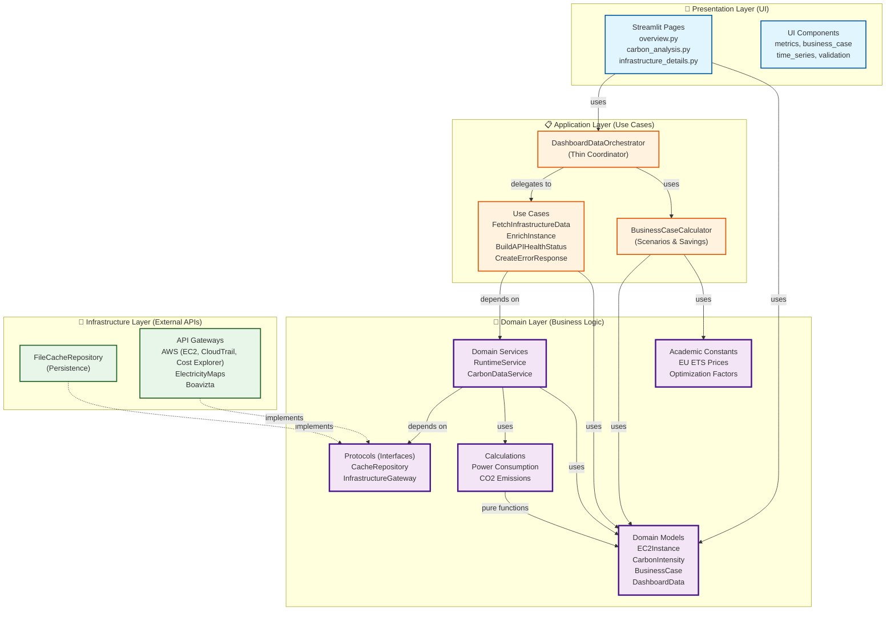

# Clean Architecture - Layer Diagram

## 🏗️ 4-Layer Architecture Overview

This diagram shows the Clean Architecture implementation with strict dependency flow.



## 📐 Dependency Rules

### ✅ Allowed Dependencies (Inward Only)

1. **Presentation → Application:** UI calls orchestrator and use cases
2. **Application → Domain:** Use cases depend on domain services (via protocols)
3. **Domain → Nothing:** Domain is self-contained (no external dependencies)
4. **Infrastructure → Domain:** Infrastructure implements domain protocols

### ❌ Forbidden Dependencies (Violated Clean Architecture)

1. **Domain → Infrastructure:** ❌ Domain must NOT depend on concrete infrastructure
2. **Domain → Application:** ❌ Domain must NOT know about application layer
3. **Domain → Presentation:** ❌ Domain must NOT know about UI

## 🔑 Key Design Patterns

### 1. Protocol-Based Dependency Inversion

**Problem:** Domain services needed cache and API access without coupling to infrastructure.

**Solution:** Define protocols (interfaces) in domain layer:

```python
# src/domain/protocols.py
class CacheRepository(Protocol):
    def get(self, category: str, key: str) -> Optional[Any]: ...
    def set(self, category: str, key: str, value: Any) -> bool: ...

class InfrastructureGateway(Protocol):
    def list_ec2_instances(self, region: str) -> List[Any]: ...
    def get_cloudtrail_events(...) -> List[Any]: ...
```

Infrastructure implements these protocols via duck typing:

```python
# src/infrastructure/cache.py
class FileCacheRepository:  # Implements CacheRepository protocol
    def get(self, category: str, key: str) -> Optional[Any]: ...
    def set(self, category: str, key: str, value: Any) -> bool: ...
```

### 2. Use Case Pattern

**Problem:** Orchestrator was doing too many things (485 LoC, multiple responsibilities).

**Solution:** Extract single-responsibility use cases:

- **EnrichInstanceUseCase:** Enrich single EC2 instance with runtime/carbon/cost
- **FetchInfrastructureDataUseCase:** Main workflow orchestration (13 steps)
- **BuildAPIHealthStatusUseCase:** Monitor API health and build status
- **CreateErrorResponseUseCase:** Handle errors and create appropriate responses

**Result:** Orchestrator reduced to 198 LoC (-59%), now just a thin coordinator.

### 3. Factory Functions for Wiring

**Problem:** Domain services need concrete infrastructure, but can't import it directly.

**Solution:** Factory functions in domain layer handle concrete instantiation:

```python
# src/domain/services/__init__.py
def create_runtime_service(
    repository: Optional[CacheRepository] = None,
    gateway: Optional[InfrastructureGateway] = None,
) -> RuntimeService:
    repository = repository or _default_repository()  # Creates FileCacheRepository
    gateway = gateway or _default_gateway(repository)
    return RuntimeService(repository=repository, gateway=gateway)
```

## 📊 Impact Metrics

| **Metric** | **Before** | **After** | **Improvement** |
|------------|-----------|-----------|-----------------|
| Orchestrator LoC | 485 | 198 | -59% |
| Clean Architecture Violations | 5+ | 0 | -100% |
| Use Cases | 0 | 4 | +4 |
| Protocol-Based Design | No | Yes | ✅ |
| Testability | Low | High | ✅ |

## 🎓 Academic Justification

**Clean Architecture** (Robert C. Martin, 2012):
- **Dependency Rule:** Source code dependencies point inward only
- **Separation of Concerns:** Each layer has distinct responsibility
- **Testability:** Business logic isolated from infrastructure
- **Maintainability:** Changes to external APIs don't affect business rules

**Benefits for Bachelor Thesis:**
- Demonstrates understanding of software architecture principles
- Shows professional-level code organization
- Makes system extensible (easy to add new cloud providers, APIs)
- Facilitates testing (mock protocols instead of concrete implementations)

---

**Status:** ✅ Fully Implemented
**Last Updated:** 2025-10-07
