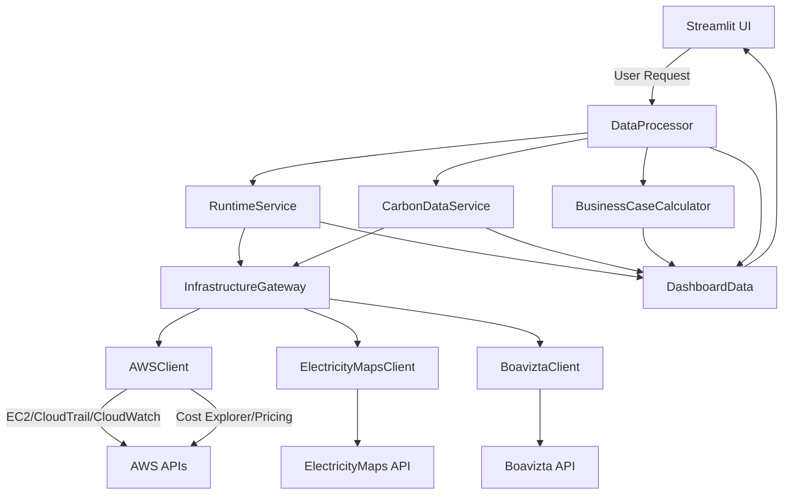

# Systemarchitektur: Carbon-Aware FinOps Dashboard

## 1. Einordnung
- **Forschungsfrage:** Wie lässt sich ein integriertes Monitoring-System entwickeln, das Kosten und CO₂-Emissionen von Cloud-Infrastrukturen simultan erfasst, und welche Vorteile bietet dieser Ansatz gegenüber bestehenden getrennten Lösungen?
- **Projektziel:** Referenzarchitektur für deutsche KMU (ca. 20–100 AWS-Instanzen) mit klarer Trennung von Datenakquise, Verarbeitung und Visualisierung.
- **Methodik:** Design-Science-Ansatz mit iterativen Build-Evaluate-Zyklen und nachvollziehbarer Dokumentation.

## 2. Projektstruktur (Phase 0.5 - Konsolidiert)
```
CarbonAware_FinOps_Local/
├── src/
│   ├── app.py               # Streamlit-Einstieg und Seitenrouting
│   ├── domain/              # Domain-Layer (KONSOLIDIERT)
│   │   ├── models.py        # Alle Domain-Modelle (EC2, Carbon, Business, Dashboard)
│   │   ├── services/        # Domain-Services (RuntimeService, CarbonDataService)
│   │   ├── calculations.py  # Kern-Berechnungslogik (CO2, Leistung)
│   │   ├── validation.py    # Datenqualitäts- und Plausibilitätschecks
│   │   ├── constants.py     # Akademische Konstanten
│   │   └── errors.py        # Domain-spezifische Exceptions
│   ├── application/         # Application-Layer (VEREINFACHT)
│   │   ├── orchestrator.py  # Dashboard-Daten-Orchestrierung
│   │   └── calculator.py    # Business-Case-Berechnungen
│   ├── infrastructure/      # Infrastruktur-Layer (OPTIMIERT)
│   │   ├── gateways/        # API-Adapter (aws.py, electricity.py, boavizta.py)
│   │   └── cache.py         # Cache-Repository & Time-Series-Store
│   ├── presentation/        # Präsentations-Layer
│   │   ├── pages/           # Streamlit-Seiten
│   │   └── components/      # Wiederverwendbare UI-Komponenten
│   ├── config/              # Pydantic-Settings und Konfiguration
│   ├── assets/              # CSS und statische Ressourcen
│   └── vendor/              # Externe Stub-Implementierungen
├── docs/                    # Methodik, Architektur, Evaluation, Literatur
├── tests/                   # Unit- und Integrationstests
├── terraform/               # Reproduzierbare AWS-Testumgebung
├── automation_scripts/      # Import-Update und Refactoring-Skripte
├── Makefile                 # Automatisierte Workflows (Setup, Tests, Dashboard)
└── requirements*.txt        # Abhängigkeitsmanagement
```

**Architektur-Verbesserungen (Phase 0.5):**
- ✅ 3 Domain-Verzeichnisse → 1 konsolidiertes `domain/`
- ✅ 4 Model-Dateien → 1 zentrales `models.py` (194 LoC)
- ✅ `shared/` aufgelöst → Funktionen in `domain/` integriert
- ✅ Leere Verzeichnisse entfernt (use_cases/, discovery/, enrichment/, monitoring/)
- ✅ Flache Struktur in `application/` und `infrastructure/`
- ✅ Redundante Suffixe entfernt (_api_gateway → .py)

## 3. Schichtenmodell (Clean Architecture)
- **Präsentation (`src/presentation/`)**
  - Streamlit-basierte Oberfläche mit Executive Summary und Infrastrukturdetail.
  - Modulare UI-Komponenten in `src/presentation/components/` (Grid Status, Metrics, Business Case, Validation, Time Series).
  - Einheitliche CSS-Assets in `src/assets/`.
- **Application (`src/application/`)**
  - `orchestrator.py`: Orchestriert Domain-Services, konsolidiert Messwerte und erstellt `DashboardData`.
  - `calculator.py`: Business-Case-Berechnungen, Wirtschaftlichkeits- und Emissionslogik, Kostenvalidierung gegen AWS Cost Explorer.
- **Domain (`src/domain/`)** - Kernlogik ohne externe Abhängigkeiten
  - `models.py`: Alle Domain-Entitäten (EC2Instance, CarbonIntensity, BusinessCase, DashboardData).
  - `services/`: RuntimeService (EC2-Discovery, CloudTrail, CloudWatch), CarbonDataService (ElectricityMaps, TAC).
  - `calculations.py`: Wissenschaftliche Berechnungslogik (CO2, Leistung, akademisch dokumentiert).
  - `validation.py`: Datenqualitäts- und Plausibilitätschecks.
  - `constants.py`: Akademische Konstanten aus Literatur (EU ETS-Preise, Optimierungsfaktoren).
  - `errors.py`: Domain-spezifische Exceptions.
- **Infrastructure (`src/infrastructure/`)**
  - `gateways/`: Alle externen API-Adapter (aws.py, electricity.py, boavizta.py).
  - `InfrastructureGateway`: **Einheitlicher Gateway** für alle API-Clients (EC2, CloudTrail, CloudWatch, Cost Explorer, Pricing, ElectricityMaps, Boavizta).
  - `AWSClient`: Zentraler AWS SDK-Client für alle AWS-Services (ersetzt das alte Dual-Gateway-Pattern).
  - `cache.py` & `time_series.py` stellen wiederverwendbare Infrastruktur-Bausteine bereit.
- **Domänenmodell (`src/models/`)**
  - Typisierte Dataclasses für EC2-Instanzen, Carbon-Metriken, Business Cases und Dashboard-Responses.
  - Enthalten Metadaten zu Datenquellen, Unsicherheiten und Aktualität.
  - Vollständige Type Hints (z.B. `CarbonIntensity` statt `Any`).
- **Konfiguration (`src/config/` & `src/constants.py`)**
  - `settings.py`: Zentralisierte Pydantic-Settings mit Umgebungsvariablen-Support (laufzeitabhängige Parameter).
  - `constants.py`: **Akademische Konstanten** aus Literatur (EU ETS-Preise, Optimierungsfaktoren) – NICHT konfigurierbar.
  - Klare Trennung: `settings.py` = dynamisch, `constants.py` = wissenschaftlich fixiert.
- **Querschnitt (`src/utils/`)**
  - `calculations.py`: Mathematische Kernfunktionen (z. B. Leistungsmodell, Rundungslogik).
  - `validation.py` und `errors.py`: Gemeinsame Validierungs- und Fehlermeldungsstrukturen.
  - `ui.py`: UI-Hilfsfunktionen (z. B. Grid-Status-Berechnung).


## 4. Datenfluss (Vereinheitlicht)


**Wichtige Änderungen zum Ursprungsdesign:**
- **Einheitliches Gateway-Pattern**: `InfrastructureGateway` ist nun der EINZIGE Einstiegspunkt für alle APIs.
- **AWSClient konsolidiert**: Ersetzt das alte Dual-Gateway-Pattern (früher `AWSBillingClient` + `AWSRuntimeGateway`).
- **Direkte Calculator-Nutzung**: `BusinessInsightsService` wurde entfernt, `DataProcessor` nutzt `BusinessCaseCalculator` direkt.

## 5. API-Layer und Datenmodelle
- **InfrastructureGateway (`src/infrastructure/gateways/__init__.py`):** Einheitlicher Gateway, der alle API-Clients aggregiert und eine konsistente Schnittstelle für Domain-Services bereitstellt.
- **AWSClient (`src/infrastructure/gateways/aws.py`):** **Konsolidierter AWS-Client** für alle AWS-Services:
  - **EC2 Discovery**: `list_instances(region)` - Instance-Metadaten abrufen
  - **CloudTrail**: `lookup_instance_events(...)` - Start/Stop-Events für Laufzeitberechnung
  - **CloudWatch**: `fetch_cpu_metrics(...)` - CPU-Auslastung für Leistungsmodelle
  - **Cost Explorer**: `get_monthly_costs(...)`, `get_hourly_costs(...)` - Kostenvalidierung
  - **Pricing API**: `get_instance_pricing(...)` - On-Demand-Preise
  - Ersetzt das alte Dual-Gateway-Pattern (früher `AWSBillingClient` + `AWSRuntimeGateway`).
- **ElectricityMapsClient (`src/infrastructure/gateways/electricity.py`):** Liefert aktuelle Intensitäten sowie 24h-Historien inklusive Self-Collection.
- **BoaviztaClient (`src/infrastructure/gateways/boavizta.py`):** Berechnet Leistungsprofile für AWS-Instanzen.

| Methode | Quelle | Zweck | Rückgabe |
|---------|--------|-------|----------|
| `get_current_carbon_intensity(zone)` | ElectricityMaps | Echtzeit-Netzintensität | `Optional[CarbonIntensity]` |
| `get_carbon_intensity_24h(zone)` | ElectricityMaps | Trendanalyse auf 24h-Basis | `Optional[List[CarbonPoint]]` |
| `get_power_profile(instance_type)` | Boavizta | Leistungsmodell (min/avg/max) | `Optional[PowerProfile]` |
| `get_monthly_costs()` | AWS Cost Explorer | Validierung der Ausgaben | `Optional[AWSCostData]` |
| `get_hourly_costs(hours)` | AWS Cost Explorer | Stündliche EC2-Kosten (48 h) | `Optional[List[dict]]` |
| `get_instance_pricing(instance_type, region)` | AWS Pricing | On-Demand-Preis pro Instanz | `Optional[InstancePrice]` |

**Genutzte Dataclasses (`src/models/`):** `CarbonIntensity`, `PowerProfile`, `AWSCostData`, `DashboardData` (inkl. `APIHealthStatus` & `TimeSeriesPoint`) dokumentieren Quellen, Zeitstempel und Unsicherheiten.

## 6. Cache-Mechanismen
| Datenquelle | Modul | Cache-TTL (`CacheTTL`) | Begründung |
|-------------|-------|------------------------|------------|
| ElectricityMaps (aktuell) | `src/infrastructure/clients/electricity.py` | 60 Minuten (`CARBON_DATA`) | Netzintensität ändert sich stündlich.
| ElectricityMaps (24h) | `src/infrastructure/clients/electricity.py` | 2 Stunden (`CARBON_24H`) | Historische Daten können länger gecacht werden.
| Boavizta Hardwareprofile | `src/infrastructure/clients/boavizta.py` | 7 Tage (`POWER_DATA`) | Instanzmodelle ändern sich selten.
| AWS Pricing | `src/infrastructure/clients/aws.py` | 7 Tage (`PRICING_DATA`) | Listenpreise werden selten angepasst.
| AWS Cost Explorer | `src/infrastructure/gateways/aws.py` | 24 Stunden (`COST_DATA`) | Cost Explorer aktualisiert täglich.
| AWS CloudWatch | `src/infrastructure/gateways/aws.py` | 1 Stunde (`CPU_UTILIZATION`) | Synchron mit ElectricityMaps für operational metrics.
| AWS CloudTrail | `src/domain/services/runtime.py` | 3 Stunden (`CLOUDTRAIL_EVENTS`) | Balance zwischen Aktualität und API-Kosten.
| Cost/Carbon Time Series | `src/core/processor.py` | 48 Stunden (lokale JSON-Snapshots) | Grundlage für TAC-Visualisierung im Dashboard.

Die Cache-Funktionen (`src/infrastructure/cache.py`) verwalten Pfade, TTLs und Bereinigung; `FileCacheRepository.clean_old` verhindert überalterte Artefakte. Dadurch sinkt das API-Aufkommen um >80 % und die Betriebskosten bleiben im KMU-Rahmen.

## 7. Qualitätsmechanismen
- **No-Fallback-Policy:** Jeder API-Ausfall wird sichtbar gemacht (`None`/Warnungen statt synthetischer Werte).
- **Unsicherheitsmetadaten:** `DashboardData` speichert Intervallangaben (z. B. ±15 % für Carbon-Szenarien).
- **Validierung:** `BusinessCaseCalculator.calculate_cloudtrail_enhanced_accuracy` gleicht berechnete Kosten mit AWS-Kosten ab.
- **Tests:** Unit-Tests für Kalkulationen und Tracker (`tests/unit/`), Integrationstest-Skript für End-to-End-Durchläufe (`tests/integration/`).

## 8. Anschluss an die Thesis
- **Design-Science-Artefakt:** Architektur dient als Artefakt im Sinne von Hevner et al. mit dokumentiertem Nutzenbeitrag für KMU.
- **Evaluationsgrundlage:** Struktur ermöglicht Messung der Forschungskennzahlen (Kostenabweichung, CO₂-Einsparungspotenziale, Datenverfügbarkeit).
- **Reproduzierbarkeit:** Makefile-Workflows und Requirements-Dateien sichern Wiederholbarkeit der Experimente.

## 9. Weiterführende Dokumente
- `docs/user-guide.md` – detaillierte Schritte zur Inbetriebnahme.
- `docs/calculations.md` – verwendete Formeln und Unsicherheiten.
- `docs/cloudtrail-methodology.md` – präzise Laufzeiterfassung.
- `docs/validation-results.md` – Ergebnisse der Integrationsläufe.
