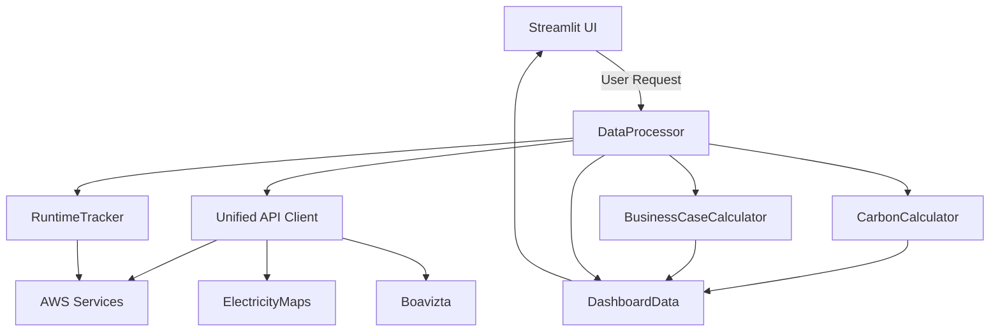

# Systemarchitektur: Carbon-Aware FinOps Dashboard

## 1. Einordnung
- **Forschungsfrage:** Wie lässt sich ein integriertes Monitoring-System entwickeln, das Kosten und CO₂-Emissionen von Cloud-Infrastrukturen simultan erfasst, und welche Vorteile bietet dieser Ansatz gegenüber bestehenden getrennten Lösungen?
- **Projektziel:** Referenzarchitektur für deutsche KMU (ca. 20–100 AWS-Instanzen) mit klarer Trennung von Datenakquise, Verarbeitung und Visualisierung.
- **Methodik:** Design-Science-Ansatz mit iterativen Build-Evaluate-Zyklen und nachvollziehbarer Dokumentation.

## 2. Projektstruktur
```
CarbonAware_FinOps_Local/
├── src/
│   ├── app.py               # Streamlit-Einstieg und Seitenrouting
│   ├── api/                 # Integrationen: ElectricityMaps, AWS, Boavizta
│   ├── core/                # DataProcessor, Tracker, Kalkulatoren
│   ├── models/              # Dataclasses für Dashboard-, Business- und AWS-Objekte
│   ├── utils/               # Cache-, Berechnungs-, Logging- und Validierungshilfen
│   └── views/               # Streamlit-Komponenten (Übersicht, Carbon, Infrastruktur)
├── docs/                    # Methodik, Architektur, Evaluation, Literatur
├── tests/                   # Unit- und Integrationstests
├── terraform/               # Reproduzierbare AWS-Testumgebung
├── Makefile                 # Automatisierte Workflows (Setup, Tests, Dashboard)
└── requirements*.txt        # Abhängigkeitsmanagement
```

## 3. Schichtenmodell
- **Präsentation (`src/app.py`, `src/views/`)**
  - Streamlit-basierte Oberfläche mit Executive Summary, Carbon-Analyse und Infrastrukturdetail.
  - Einheitliche UI-Hilfen über `src/utils/ui.py` und CSS-Assets.
- **Verarbeitung (`src/core/`)**
  - `DataProcessor`: Orchestriert API-Aufrufe, konsolidiert Messwerte und erstellt `DashboardData`.
  - `RuntimeTracker`: Greift auf CloudTrail-Events zu und ermittelt Laufzeiten mit Auditgranularität.
  - `CarbonCalculator`/`BusinessCaseCalculator`: Abbildung von Emissions- und Wirtschaftlichkeitslogik.
- **Integration (`src/api/`)**
  - Kapselt ElectricityMaps-, Boavizta- und AWS-spezifische Endpunkte.
  - Einheitlicher Zugriff über `unified_api_client` mit Caching und Fehlertoleranz.
- **Domänenmodell (`src/models/`)**
  - Typisierte Dataclasses für EC2-Instanzen, Carbon-Metriken, Business Cases und Dashboard-Responses.
  - Enthalten Metadaten zu Datenquellen, Unsicherheiten und Aktualität.
- **Querschnitt (`src/utils/`)**
  - `cache.py`: Standardisierte Cachepfade, TTL-Verwaltung, Reinigung.
  - `calculations.py`: Mathematische Kernfunktionen (z. B. Leistungsmodell, Rundungslogik).
  - `validation.py` und `errors.py`: Gemeinsame Validierungs- und Fehlermeldungsstrukturen.

## 4. Datenfluss


## 5. API-Layer und Datenmodelle
- **UnifiedAPIClient (`src/api/client.py`):** Bündelt ElectricityMaps-, Boavizta- und AWS-Aufrufe und propagiert Fehler im Sinne der No-Fallback-Policy.
- **AWS-Hilfsklassen (`src/api/aws.py`):** Stellt spezialisierte Clients für Cost Explorer, Pricing und CloudWatch bereit; nutzt gemeinsame Cache-Helfer.
- **Stündliche Kostenserie:** `AWSAPIClient.get_hourly_costs` liefert EC2-Kosten (USD→EUR) für die letzten 48 h als Basis für TAC.
- **ElectricityMaps (`src/api/electricity.py`):** Liefert aktuelle Intensitäten sowie 24h-Historien für die deutsche Zone.
- **Boavizta (`src/api/boavizta.py`):** Berechnet Leistungsprofile für AWS-Instanzen.

| Methode | Quelle | Zweck | Rückgabe |
|---------|--------|-------|----------|
| `get_current_carbon_intensity(zone)` | ElectricityMaps | Echtzeit-Netzintensität | `Optional[CarbonIntensity]` |
| `get_carbon_intensity_24h(zone)` | ElectricityMaps | Trendanalyse auf 24h-Basis | `Optional[List[CarbonPoint]]` |
| `get_power_profile(instance_type)` | Boavizta | Leistungsmodell (min/avg/max) | `Optional[PowerProfile]` |
| `get_monthly_costs()` | AWS Cost Explorer | Validierung der Ausgaben | `Optional[AWSCostData]` |
| `get_hourly_costs(hours)` | AWS Cost Explorer | Stündliche EC2-Kosten (48 h) | `Optional[List[dict]]` |
| `get_instance_pricing(instance_type, region)` | AWS Pricing | On-Demand-Preis pro Instanz | `Optional[InstancePrice]` |

**Genutzte Dataclasses (`src/models/`):** `CarbonIntensity`, `PowerProfile`, `AWSCostData`, `DashboardData` (inkl. `APIHealthStatus` & `TimeSeriesPoint`) dokumentieren Quellen, Zeitstempel und Unsicherheiten.

## 6. Cache-Mechanismen
| Datenquelle | Modul | Cache-TTL (`CacheTTL`) | Begründung |
|-------------|-------|------------------------|------------|
| ElectricityMaps (aktuell) | `src/api/electricity.py` | 30 Minuten (`CARBON_DATA`) | Netzintensität ändert sich im 15–60-Minuten-Takt.
| ElectricityMaps (24h) | `src/api/electricity.py` | 24 Stunden (`CARBON_24H`) | Historische Daten sind stabil.
| Boavizta Hardwareprofile | `src/api/boavizta.py` | 7 Tage (`POWER_DATA`) | Instanzmodelle ändern sich selten.
| AWS Pricing | `src/api/aws.py` | 7 Tage (`PRICING_DATA`) | Listenpreise werden selten angepasst.
| AWS Cost Explorer | `src/api/aws.py` | 6 Stunden (`COST_DATA`) | Abrechnungsdaten werden täglich aktualisiert.
| AWS CloudWatch | `src/api/aws.py` | 3 Stunden (`CPU_UTILIZATION`) | Balance aus Aktualität und API-Kosten.
| AWS CloudTrail | `src/core/tracker.py` | 24 Stunden (`CLOUDTRAIL_EVENTS`) | Events sind unveränderlich, tägliche Synchronisation genügt.
| Cost/Carbon Time Series | `src/core/processor.py` | 48 Stunden (lokale JSON-Snapshots) | Grundlage für TAC und Trade-off-Visualisierung.

Die Cache-Funktionen (`src/utils/cache.py`) verwalten Pfade, TTLs und Bereinigung; `clean_old_cache_files` verhindert überalterte Artefakte. Dadurch sinkt das API-Aufkommen um >80 % und die Betriebskosten bleiben im KMU-Rahmen.

## 7. Qualitätsmechanismen
- **No-Fallback-Policy:** Jeder API-Ausfall wird sichtbar gemacht (`None`/Warnungen statt synthetischer Werte).
- **Unsicherheitsmetadaten:** `DashboardData` speichert Intervallangaben (z. B. ±15 % für Carbon-Szenarien).
- **Validierung:** `BusinessCaseCalculator.calculate_cloudtrail_enhanced_accuracy` gleicht berechnete Kosten mit AWS-Kosten ab.
- **Tests:** Unit-Tests für Kalkulationen und Tracker (`tests/unit/`), Integrationstest-Skript für End-to-End-Durchläufe (`tests/integration/`).

## 8. Anschluss an die Thesis
- **Design-Science-Artefakt:** Architektur dient als Artefakt im Sinne von Hevner et al. mit dokumentiertem Nutzenbeitrag für KMU.
- **Evaluationsgrundlage:** Struktur ermöglicht Messung der Forschungskennzahlen (Kostenabweichung, CO₂-Einsparungspotenziale, Datenverfügbarkeit).
- **Reproduzierbarkeit:** Makefile-Workflows und Requirements-Dateien sichern Wiederholbarkeit der Experimente.

## 9. Weiterführende Dokumente
- `docs/user-guide.md` – detaillierte Schritte zur Inbetriebnahme.
- `docs/calculations.md` – verwendete Formeln und Unsicherheiten.
- `docs/cloudtrail-methodology.md` – präzise Laufzeiterfassung.
- `docs/validation-results.md` – Ergebnisse der Integrationsläufe.
